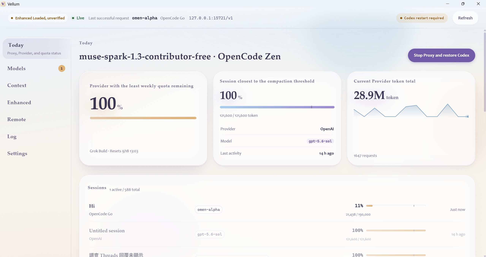
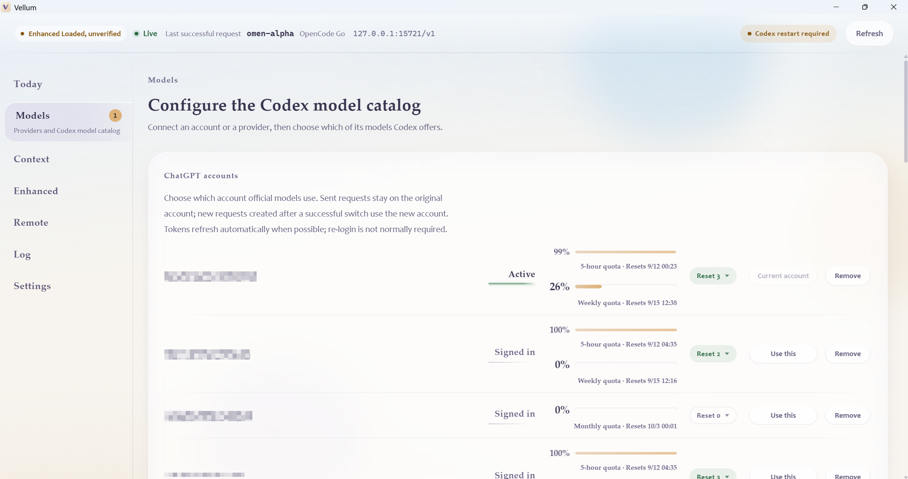
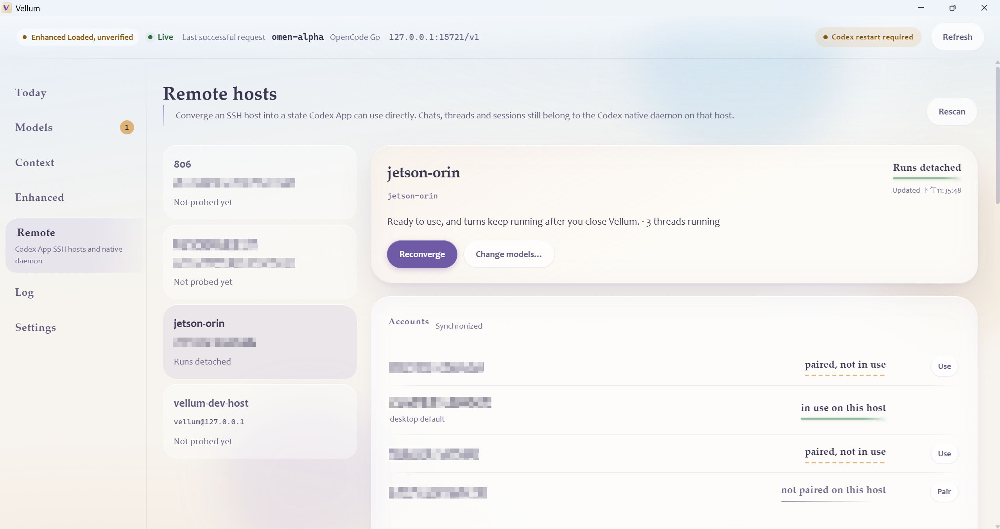

<a href="README.md">English</a> · 繁體中文

<h1 align="center">Vellum</h1>

<strong>更多模型，熟悉的 Codex。</strong>

模型選擇、遠端續作、代理協作。 為個人開發者打造，支援 Windows 與 macOS。

<a href="../../releases/latest">下載</a> · <a href="docs/README.md">文件</a> · <a href="BUILDING.md">從原始碼建置</a>

## 讓預算，容納更多開發。

當 Plus 帳號的額度不夠支應日常開發，Vellum 讓你在 Codex 中使用受支援的第三方模型。依預算與任務選擇模型，延續熟悉的專案、工具與核准流程。

第三方服務依各自方案計費與限額，Plus 本身的額度不變。

## 模型與額度，一處掌握。

連接供應商、選擇 Codex 可用的模型，集中查看帳號額度。官方 OpenAI 請求維持原生協定。

## 連線中斷，工作繼續。

Remote Manager 將桌面連線與遠端執行分開。離開時 detach，回來後重新連接同一個 Codex session。

只要遠端主機與服務持續運作，Codex daemon 就能讓任務繼續執行。Vellum 負責部署、模型設定與主機狀態管理。

## 圍繞你的工作習慣。

- **原生子代理。** 設定分工任務的預設模型與推理強度，追蹤執行進度。
- **Enhanced Codex Core。** 為第三方 Desktop 任務加入工具呼叫防護、上下文恢復與有界續行；官方任務維持原版 Codex 核心。
- **用量觀察。** 查看上下文壓力、Token 累計與請求紀錄。

## 開始使用

[下載最新版本](../../releases/latest)，支援 Windows x64 與 macOS Apple 晶片。需搭配相容的 Codex 安裝；Remote Manager 可管理具備 Docker 與 systemd 使用者工作階段的 Linux SSH 主機，或登入後常駐的 Apple Silicon Mac（Intel Mac 尚未支援）。

環境需求請參閱[建置與設定說明](BUILDING.md)，配置方式與技術細節請從[文件索引](docs/README.md)開始。

---

[Apache 2.0](LICENSE) · [第三方授權聲明](THIRD_PARTY_NOTICES.md)

Vellum 為獨立專案，與 OpenAI 無隸屬關係。
